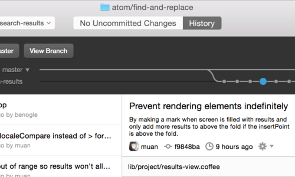

# 시작하기 - Git 설치

Git을 사용하는 방법은 많다. CLI로 사용할 수도 있고 GUI를 사용할 수도 있다. 이 책에서는 Git CLI 사용업을 설명한다. Git의 모든 기능을 지원하는 것은 CLI 뿐이다. GUI 프로그램의 대부분은 Git 기능을 전부구현하지 않아서 비교적 단순하다. CLI를 사용할 줄 알면 GUI도 사용할 수 있지만 반대는 성립하지 않는다.

윈도우 기준으로 설명을 진행하며 Terminal이나 CMD를 실행시키는 방법은 알고 있을 거라고 가정했다. 만약 이 말이 무슨 말인지 모르겠다면 일단 여기서 멈추고 째빨리 배우길 바란다.

>이 책은 Git 2.0.0 버전을 기준으로 썼다. 그래도 대부분의 명령어는 그 이전 버전에서도 잘 동작한다. 하지만, 몇 가지 기능은 아예 없거나 미요하게 다를 수 있다.

윈도우에 Git을 설치하는 방법은 여러 가지다. 공식 배포판은 Git 웹사이트에서 내려 받을 수 있다.
<http://git-scm.com/download/win>에 가면 자동으로 내려받는다. 자세한 정보는 <https://git-for-windows.github.io/>에서 확인한다.

GitHub for Windows를 설치해도 된다. 이 인스톨러는 CLI도 설치하고 GUI도 설치한다. <http://windows.github.com>에서 내려 받는다

[link keyword][id]
[id]: http://naver.com "Optional Title here"

Link: [Google][googlelink]
[googlelink]: https://google.com "Go google"

ㅇㅇ
